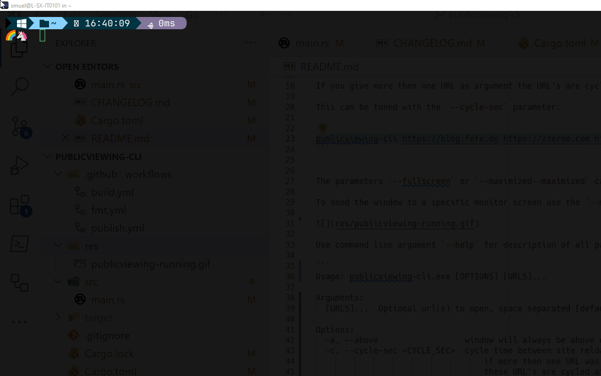

# Publicviewing-Cli

Small command line application that displays one or many given URLs
in a OS native WebView.

Use command line argument `-h` for description of all parameters.

# License

**GPL-3.0-or-later**
